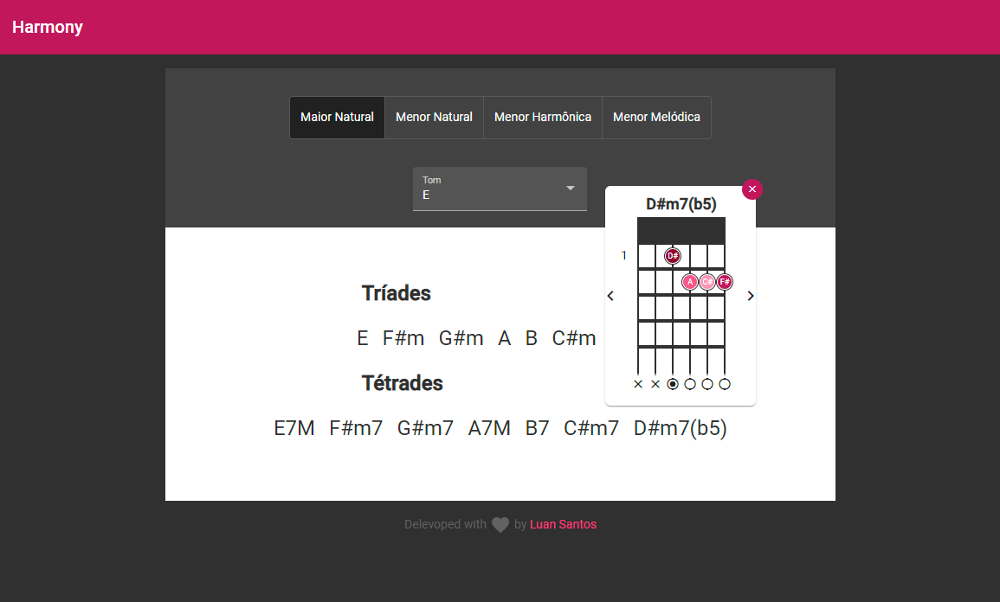

# Harmony-Web
All chords based on a key and a harmonic field

Running on: https://harmony.app.br/

## Home page - E Major - D#m7(5)

## Core Data Strucutre (Classes diagram)
How classes are organized to model the music theory of harmonic fields (chords, shapes, notes)

A Tone has HarmonicFields, witch are made of Chords. Each Chord can be played in the guitar in different Shapes. A Shape is built with ChordNotes, defining a fret and a string to be pressed in the guitar.

